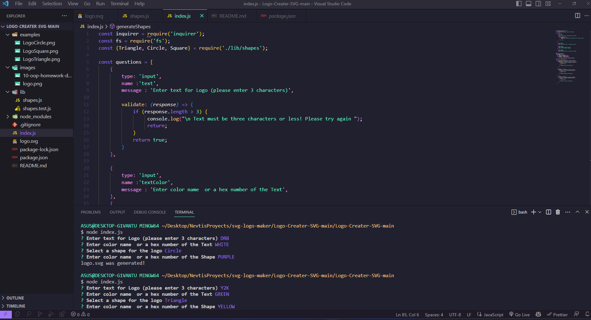
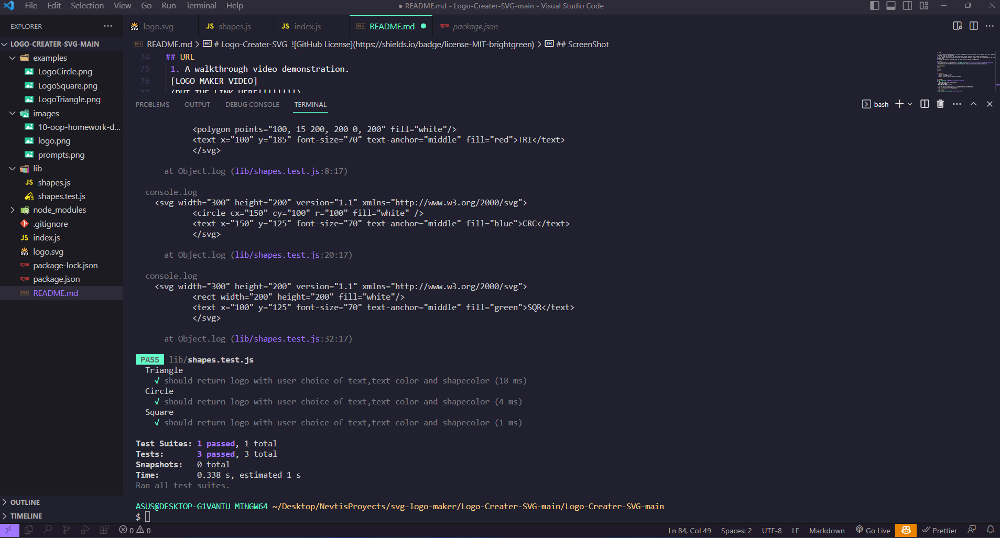

# Logo-Creater-SVG  
Object-oriented Programming Challenge: SVG Logo Maker

## Description 
The application allows users to create a 'logo.svg' file by inputting three characters of text, choosing a text color, selecting a shape (circle, triangle, or square), and choosing a shape color.

## Table of contents :
  * [Installation](#installation)
  * [Usage](#usage)
  * [License](#license)
  * [Contributors](#contributors)
  * [Test](#test)
  * [Contact](#contact)

## Task 
Your task is to build a Node.js command-line application that takes in user input to generate a logo and save it as an SVG file. The application prompts the user to select a color and shape, provide text for the logo, and save the generated SVG to a .svg file.

## User Story 
AS a freelance web developer
I WANT to generate a simple logo for my projects
SO THAT I don't have to pay a graphic designer

## Acceptence Criteria
GIVEN a command-line application that accepts user input
1. WHEN I am prompted for text
THEN I can enter up to three characters
2. WHEN I am prompted for the text color
THEN I can enter a color keyword (OR a hexadecimal number)
3. WHEN I am prompted for a shape
THEN I am presented with a list of shapes to choose from: circle, triangle, and square
4. WHEN I am prompted for the shape's color
THEN I can enter a color keyword (OR a hexadecimal number)
5. WHEN I have entered input for all the prompts
THEN an SVG file is created named `logo.svg`
AND the output text "Generated logo.svg" is printed in the command line
6. WHEN I open the `logo.svg` file in a browser
THEN I am shown a 300x200 pixel image that matches the criteria I entered.

## Installation

1. You need Install NODE.js to run this application (https://nodejs.org/)
2. Generate a .gitignore file and add entries for both 'node_modules/' and '.DS_Store/' to prevent tracking and uploading of your 'node_modules' directory on GitHub. Ensure you create the .gitignore file before installing any npm dependencies.
3. Confirm that your repository contains a 'package.json' file with the necessary dependencies. You can create one by executing 'npm init' during the initial project setup, prior to installing any dependencies.
4. Utilize the integrated terminal to execute the command 'npm i inquirer@8.2.4' to install the 'inquirer.js' package as a dependency.
5. Install 'jest' for testing purposes by executing the command 'npm install --save-dev jest'.
5. Launch the application by using the following command: 'node index.js'.

## Usage 

1. After launching the application, you will be asked a series of questions in the command line. Your responses to these questions will be used to create a 'logo.svg' file for your project.
2. You can find the questions for this application in the 'index.js' file within this repository.
3. Press 'Enter' after providing each answer to proceed to the next prompt. Once you've completed all the prompts, a 'logo.svg' file will be generated automatically. 
4. To view the results, open the 'logo.svg' file in a live server or web browser. 

## License  
* This application is licensed under : 
* Click the link for the detailed license information: https://choosealicense.com/licenses/mit/

## Contributors
drbv27

## Test
npm test

## Contact
  * GitHub Username : drbv27
  * Email: drbv27@gmail.com
  * GitHub profile : https://github.com/drbv27

## Mock Up

## URL
 1. A walkthrough video demonstration. 
 [LOGO MAKER VIDEO]
 (PUT THE LINK HERE!!!!!!!!)

 2. The URL of the GitHub repository. //CHANGE FOR YOUR OWN REPOSITORY
 https://github.com/drbv27/SvgLogoMaker

 ## ScreenShot

## Sample Logo generator
* [Sample Circle Logo](./examples/LogoCircle.png)
* [Sample Square Logo](./examples/LogoSquare.png)
* [Sample Triangle Logo](./examples/LogoTriangle.png)
 

